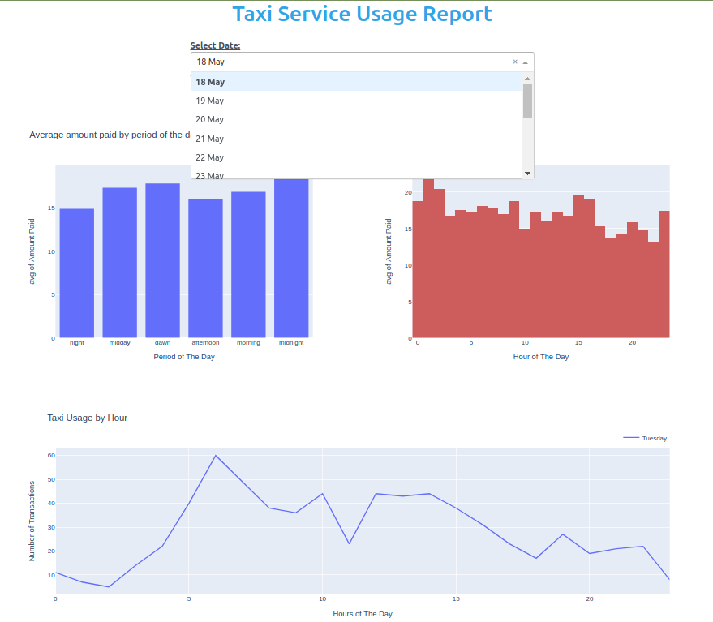

## Task File Structure:

- **Analysis Folder:** Contains the _Jupyter Notebook_ with the analysis.
- **Dashboard Folder:** Contains a jupyter notebook with a small dashboard.The dashboard consists of three graphs: 
1. average amount spent on each period of the day 
2. average amount spent on each hour of the day
3. taxi usage by hour of the day

To run the app with the dashboard install the environment ('env.yml') provided.

To install the environment:

- `git clone` this repo
- Set up the provided Anaconda virtual environment which includes the needed packages with the right versions: `conda env create -f george_env.yml`
- Activate the jobcloud environment: `conda activate george_env`
- Run `jupyter notebook / lab` and open the dashboard notebook.

#### Small preview of the Dashboard:

